# 🦆 Duck

A tiny [DankMaterialShell](https://github.com/AvengeMedia/DankMaterialShell) bar widget: a duck that says **quack** when you click it.

<p align="center">
  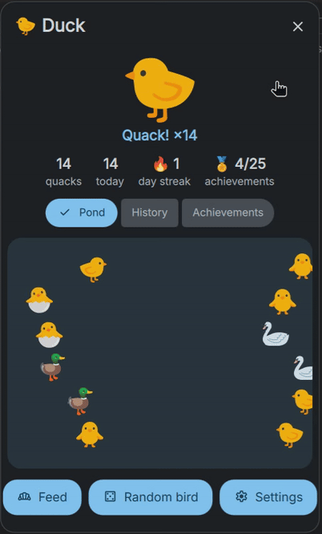
</p>

Duck is a playground plugin: a place to try out the DMS plugin API before building bigger plugins. See [ROADMAP.md](ROADMAP.md) for what's planned.

## Features

- **Click the duck, it quacks**: in horizontal and vertical bars, with the DMS ripple
- **Combos**: click fast for "Quack! ×3"… and see what happens at ×10, ×25 and ×100
- **Popout** (right-click): a big clickable duck, your stats and three tabs
  - 🦆 **Pond**: one swimming bird per quack today
  - 📜 **History**: your last 20 quacks, combos grouped
  - 🏅 **Achievements**: 25 to unlock, some of them secret
- **Feed the duck** 🍞, switch to a random bird 🎲
- **Stats**: total, today and day streak, in a hover tooltip and an optional counter
- **Pick your bird**: 🦆 🐤 🐥 🐣 🦢, in settings or by scrolling over the duck
- **Configurable**: quack text or random phrases, duration, color, left/right/middle-click actions, toasts

## Screenshots

| Pond & feeding | History | Achievements |
|:---:|:---:|:---:|
| 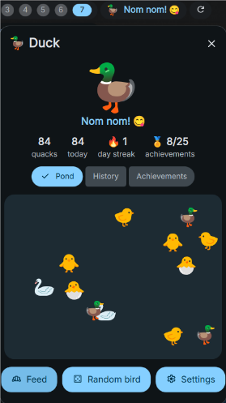 | 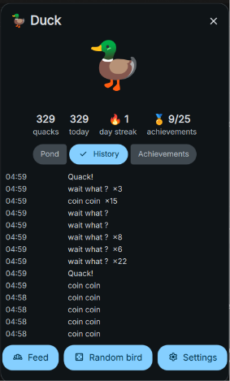 | 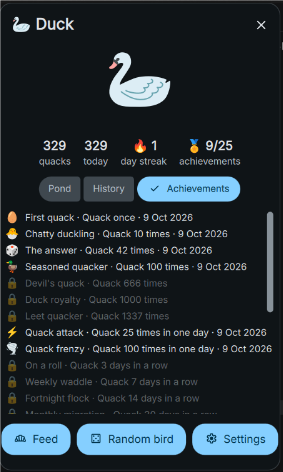 |

**In the bar**: quacking, and the hover tooltip

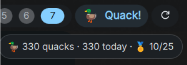 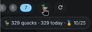

**Combos and achievements**

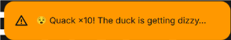<br>
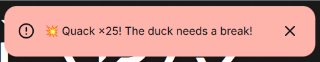<br>
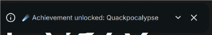

<details>
<summary><b>Settings page</b></summary>

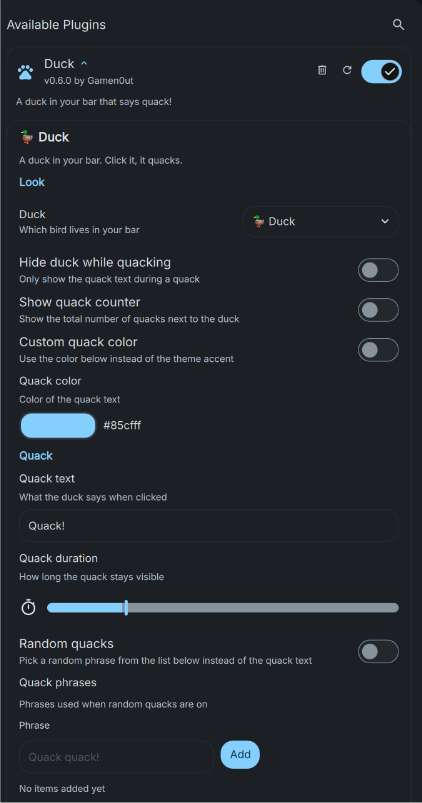
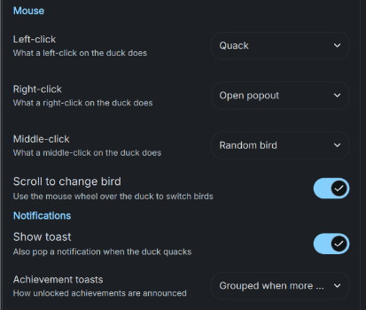
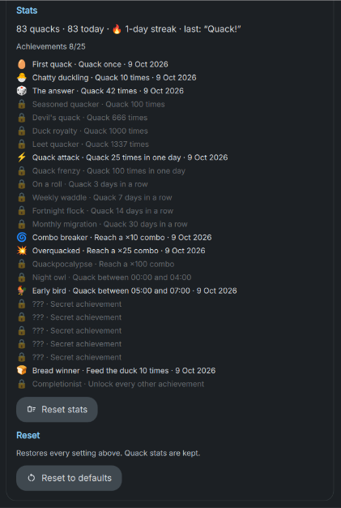

</details>

## Requirements

- DankMaterialShell **1.6.0 or newer**
- `dms` CLI available in `$PATH` (for `dev.sh reload` / `status`)

## Installation

### From source

```bash
git clone https://github.com/Gamen0ut/Duck.git
cd Duck
./dev.sh link      # symlinks this folder into ~/.config/DankMaterialShell/plugins/Duck
```

Then in DMS: **Settings → Plugins → Scan for plugins**, enable **Duck**, and add it to a bar section.

### From a release

Download `Duck-vX.Y.Z.zip` from [Releases](https://github.com/Gamen0ut/Duck/releases) and extract it into `~/.config/DankMaterialShell/plugins/`.

## Settings

| Setting                    | Key                     | Default      | Description                                     |
|----------------------------|-------------------------|--------------|-------------------------------------------------|
| Duck                       | `duckEmoji`             | `🦆`         | Which bird lives in your bar                    |
| Left-click                 | `leftClickAction`       | `quack`      | `quack` or `popout`                             |
| Right-click                | `rightClickAction`      | `popout`     | `popout`, `silent`, `randomBird`, `stats` or `none` |
| Middle-click               | `middleClickAction`     | `randomBird` | same choices as right-click                     |
| Scroll to change bird      | `scrollChangesBird`     | `true`       | Mouse wheel over the duck switches birds        |
| Hide duck while quacking   | `hideEmojiWhenQuacking` | `false`      | Only show the quack text during a quack         |
| Show quack counter         | `showCounter`           | `false`      | Show the total number of quacks next to the duck |
| Custom quack color         | `useCustomColor`        | `false`      | Use the color below instead of the theme accent |
| Quack color                | `quackColor`            | theme accent | Color of the quack text                         |
| Quack text                 | `quackText`             | `Quack!`     | What the duck says when clicked                 |
| Quack duration             | `quackDuration`         | `1500` (ms)  | How long the quack stays visible                |
| Random quacks              | `randomQuack`           | `false`      | Pick a random phrase from the list              |
| Quack phrases              | `quackPhrases`          | `[]`         | Phrases used when random quacks are on          |
| Show toast                 | `showToast`             | `true`       | Also pop a notification on each quack           |
| Achievement toasts         | `achievementToasts`     | `grouped`    | `grouped` (when more than 2), `separate` or `off` |

## Development

```bash
./dev.sh link      # symlink the plugin into the DMS plugins folder
./dev.sh reload    # hot-reload the plugin after editing QML
./dev.sh status    # check whether the plugin is loaded
```

### Project layout

```
Duck/
├── plugin.json        # manifest (id, version, entry points, permissions)
├── Duck.qml           # widget: bar pills + quack logic
├── DuckSettings.qml   # settings page
├── DuckStats.js       # pure stats logic (testable with node)
├── Birds.js           # the bird list (dropdown, scroll wheel, random bird)
├── Input.js           # pure mouse-input logic (wheel steps, combos)
├── ConfirmButton.qml  # click-twice confirmation button
├── AchievementList.qml # achievement list (settings + popout)
├── Pond.qml           # the popout's animated pond
├── tests/             # node unit tests: for f in tests/*.test.js; do node $f; done
├── screenshot.png     # main still image (plugin registry)
├── screenshots/       # README images
├── dev.sh             # dev helper (link / reload / status / release)
├── CHANGELOG.md
└── ROADMAP.md
```

## Versioning & releases

Duck follows [Semantic Versioning](https://semver.org/). The single source of truth for the version is `plugin.json`.

To cut a release:

1. Add your changes under `## [Unreleased]` in [CHANGELOG.md](CHANGELOG.md).
2. Run `./dev.sh release 0.2.0`: it bumps `plugin.json`, dates the changelog entry, updates the compare links, commits and creates the `v0.2.0` tag.
3. `git push --follow-tags`. GitHub Actions checks the tag matches `plugin.json`, zips the plugin and publishes a release with the changelog notes.

Commit messages follow [Conventional Commits](https://www.conventionalcommits.org/) (`feat:`, `fix:`, `docs:`, `chore:` …).

## License

[MIT](LICENSE) © Gamen0ut
